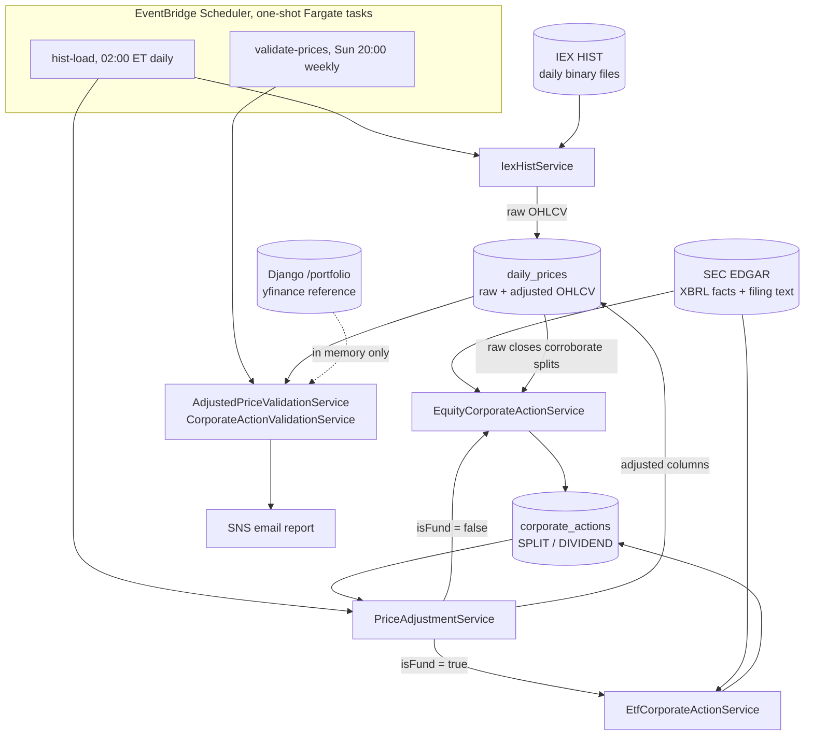

# High-Level Design: FattoreStreet

FattoreStreet is a full-stack financial portfolio and social platform. This document is the root of
its design tree, and it is authored at the depth the LID scope reaches: the price and corporate
action data pipeline that produces the adjusted price series. Product-level architecture (React,
Django, Nginx, the non-pipeline Django apps) is described in [`ARCHITECTURE.md`](ARCHITECTURE.md) and
is deliberately not restated here. Sections outside the authored scope are marked
*(not yet specified)* rather than filled with placeholder prose.

Scope is declared in `CLAUDE.md` under `## LID Scope`.

## Problem

Every price the platform displays or computes against is an *adjusted* price: a raw exchange close
rewritten backwards to absorb stock splits and cash dividends. Nothing publishes that series for
free. It has to be derived, from a raw OHLCV feed plus a corporate action history reconstructed out
of SEC filings, where the events are stated in prose and XBRL facts that were never designed to
answer "what was the ex-dividend date."

Derivation makes correctness fragile in a specific way. A missed 4:1 split leaves four years of
history off by 300%. A split dated one day late puts a visible step in the series. A duplicated
split silently double-adjusts. These errors are not loud: the series stays plausible, every chart
still renders, and the failure surfaces as a portfolio return that is quietly wrong.

The failure mode this design has to defend against is therefore not a crash but *unnoticed drift*:
detection thresholds, date-resolution precedence, and adjustment conventions are load-bearing
decisions whose violation produces no exception and no failing test. If those decisions live only in
code and in the author's head, a later change can reverse one of them without anything objecting.

## Approach

**Free sources, derived locally.** SEC EDGAR supplies corporate actions (XBRL company facts plus the
text of 8-K, 10-Q, 10-K and proxy filings). IEX HIST supplies raw daily OHLCV as one binary file per
trading day covering the entire symbol universe. Both are commercially free to use, so both may be
persisted and served. Everything user-facing is computed from them.

**Detection and adjustment are one nightly pass.** The `hist-load` job ingests the day's raw prices
and then runs corporate action detection and price adjustment over its working set, in the same
process, in that order. Raw prices are the evidence detection relies on, so detection cannot run
ahead of the load.

**Evidence is ranked, and the rank is persisted.** A split's effective date is preferably read off an
overnight break in the raw close series, failing that off filing text, failing that off the
share-count fact date. A dividend's ex-date is preferably read off the declaration that states it,
failing that off a directly extracted ex-date, failing that solved for across the year by dynamic
programming over record-date candidates, failing that synthesized from quarterly cadence. Each
persisted row carries which path produced it and a confidence score, and a weaker path may not
overwrite a stronger one on a later run.

**Two paths, one seam.** Equities and funds are detected differently and share almost nothing.
Equities go through XBRL facts (share counts, dividends per share declared) corroborated against the
price series. Funds have no such facts, so ETF distributions are extracted from N-CEN/N-CSR-family
filing text after matching series and class identity. `Asset.isFund` selects the path.

**An independent reference tests, but never feeds.** yfinance is a better-curated adjusted series
than the one derived here, and it is not licensed for commercial reuse. It is used as a test oracle
only, fetched through Django, compared in memory, and reported by email. Nothing sourced from it
reaches a table, an API response, or the UI.

**Intent is written down as checkable requirements.** The pipeline's thresholds and precedence rules
are stated as EARS specs under `docs/intent/`, and the tests that exercise them cite those spec IDs,
so a coherence audit can name which stated intent a change violated.

## Target Users

*(not yet specified: the authored scope is a backend data pipeline with no direct users. Product-level
audience is out of scope for this document.)*

## Goals

- The adjusted close series for members of the detection index matches an independent reference
  within a stated per-ticker tolerance, and the residual level error immediately across a split
  break is approximately zero.
- Every corporate action row is attributable: its source, the path that dated it, and a confidence
  score are stored with it, so a wrong value can be traced to the evidence that produced it rather
  than re-derived by reading code.
- A dividend that the SEC discloses is present in the history, even when its exact ex-date could not
  be established.
- A split that the evidence does not support is absent, including when a share-count jump suggests
  one.
- Re-running detection over a ticker is idempotent: it re-dates and corrects in place rather than
  accumulating duplicate events that compound on each other.
- The pipeline's decision thresholds are stated as specs rather than carried as folklore, so a
  change that contradicts one is visible as a spec that no longer holds.

## Non-Goals

- **Not intraday.** Daily bars only, loaded in a nightly batch. No streaming, no quotes, no
  intraday adjustment.
- **Not a general corporate action database.** Splits and cash dividends only. Spinoffs, mergers,
  rights offerings, and return-of-capital classification are out.
- **No request-triggered detection.** These are scheduled one-shot jobs. A new backend job gets a
  run mode and a schedule, not an HTTP endpoint, and this service authenticates nothing.
- **Not full-universe SEC detection.** The raw price universe is roughly 24k IEX symbols, most with
  no SEC counterpart. Automatic detection is scoped to one index's membership.
- **Not a licensed-data integration point.** No paid or non-commercially-free feed becomes a
  persisted or served source, even where it would be more accurate.

## Tenets

Ordered: when two conflict, the higher one wins.

- **Free-to-commercialize sources over better sources.** When a restricted feed would be more
  accurate than a free one, take the free one and close the accuracy gap by deriving harder. A
  restricted source may serve as a diagnostic oracle, never as a stored or served value.
- **Deterministic evidence over inference.** When a value can be read off a hard signal (an overnight
  price break, a date the filing states) prefer that to a statistically better global fit. Optimizers
  are fallbacks for the events no hard signal covers, not the primary path.
- **Guard multiplicative corrections harder than additive ones.** A wrong split ratio rescales the
  entire prior series and compounds; a wrong dividend is a sub-percent step. On thin evidence, drop
  the split and keep the dividend.
- **Provenance outranks recency.** A later run with weaker evidence does not overwrite a value
  established by stronger evidence. Self-healing on the newest answer is how a transient fetch
  failure erases a good one.

## System Design

The authored scope is two Spring Boot packages, `marketdata` (raw price ingest) and
`corporateaction` (detection, adjustment, validation), plus the tables they own.

Solid edges persist. The dashed edge does not: the reference series is compared and discarded.

Detection scope inside `hist-load` is narrower than the price universe. Each night it re-detects the
stalest fraction of the detection index's members (a rolling weekly refresh keyed on
`listings.last_sec_detection_at`) plus any in-scope ticker that moved more than 25% overnight, the
latter so a split is caught on the day it happens rather than at the next quarterly share count.
Price adjustment, unlike detection, covers every ticker holding unadjusted rows.

The five scheduled run modes share one image and are selected by `APP_RUN_MODE`. Their schedules are
kept clear of each other because the SEC rate limiter is per-process, so overlapping tasks double
the effective request rate against SEC.

## Key Design Decisions

| Decision | Alternatives considered | Rationale |
|---|---|---|
| SEC EDGAR as the source of truth for corporate actions | A commercial corporate-action feed; scraping yfinance events | Only EDGAR is authoritative and commercially free. The cost is that events must be reconstructed from prose and XBRL, which is what most of `corporateaction` exists to do. |
| IEX HIST daily binary files for raw OHLCV | Per-ticker REST calls against a quote API | One file per trading day covers the whole universe, so a day's load is a fixed small number of fetches instead of ~24k. |
| Raw and adjusted prices both persisted on `daily_prices` | Store raw only and adjust at read time | Read-time adjustment would replay the full action history on every query. Keeping raw alongside adjusted also lets a re-detection recompute adjustments from scratch. |
| Split effective date defined as the first trade date at the new price basis | Filing-stated effective date; record date | This is the date a raw price break identifies and the date the adjustment loop keys on. Holding detection and adjustment to one convention is what drives the residual error at the break to zero. |
| Absence of a corroborating price break vetoes an XBRL split candidate | Persist the candidate at low confidence | Share-count jumps also come from buybacks and issuance. A false split is multiplicative and corrupts the whole prior series, so a covered window with no break is treated as proof of absence. |
| A dividend with no establishable ex-date is persisted with a synthesized date | Skip the event | The event is real and disclosed; omitting it leaves a permanent hole in yield and total-return history. The date error is bounded and the row is tagged low confidence, so a later run with better evidence corrects it. |
| Equity and fund detection are separate services behind an `isFund` switch | One service with per-type branches | The two share no evidence source: equities have XBRL per-share facts, funds have only filing text plus a series/class identity problem. Separate paths keep two unrelated failure modes from being debugged as one. |
| yfinance reachable only as a diagnostic oracle, via Django, never persisted | Remove it entirely; or persist it as a fallback | Accuracy work needs a reference to measure against, and it is the only free one available. Routing it through Django and never storing its output keeps the licensing boundary at the process edge instead of inside the persistence layer. |
| Detection scoped to one index's membership, refreshed on a rolling weekly cycle | Nightly full-universe detection | The SEC rate limiter is per-process; a full pass over ~24k symbols takes days, and most of those symbols have no SEC counterpart. Index scope plus a large-move trigger buys same-day split detection at a fraction of the request budget. |
| Scheduled run modes, no HTTP trigger for detection or adjustment | Authenticated admin endpoints | These are long batch operations, not requests. Removing the endpoints removed the only reason this service needed authentication at all. |

## Success Metrics

- The weekly `validate-prices` report: the share of detection-index tickers whose adjusted close
  series is within tolerance of the reference, and the size of the worst residual.
- Residual level error immediately across each split break, which should be approximately zero
  rather than merely within tolerance.
- Detection diagnostics trending in the right direction: price-rejected split candidates,
  unconfirmed price-only breaks, and the share of dividends still carrying a synthesized ex-date.

**Falsification signals.** The design is not working if: the share of out-of-tolerance tickers rises
across consecutive weekly reports; a split break shows a persistent step in the adjusted series; a
ticker's event list grows duplicate splits across nightly runs; or a stored high-confidence date is
found to have been overwritten by a lower-confidence re-detection.

## References

- [`ARCHITECTURE.md`](ARCHITECTURE.md): product-level architecture, service decomposition, request flow.
- [`equity-corporate-action-process.md`](equity-corporate-action-process.md): step-by-step walkthrough of the equity pipeline, its constants, and its thresholds.
- `CLAUDE.md`: the five scheduled run modes, their crons, and the LID scope declaration.
- `.claude/rules/data-licensing-commercial-free.md`: the commercially-free-data constraint the first tenet restates.
- `docs/intent/`: the design tree beneath this document, one folder per node, each holding its design doc and EARS specs.
