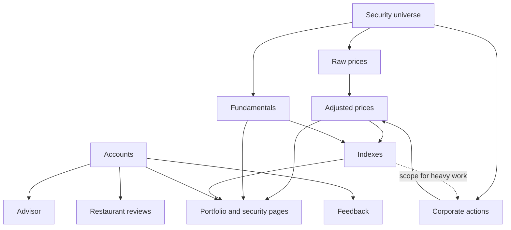

# High-Level Design

## Why

The [vision](README.md) makes promises that a generic web app design would break. Data has to be
primary-source, free to use and auditable. One person runs the whole thing on a hobby budget, and it
has to stay current without that person starting anything. Each of those forces a design choice,
and this page records the choices and the reasons for them, so a later change can tell whether it's
undoing one on purpose or by accident. The rules every part must follow are in
[principles](principles.md). This page is about the shape that follows from them.

## The parts

The product is a set of areas, each with its own branch in the tree:

- **Market data, fundamentals, indexes, economic indicators.** The platform's own public data, built
  from free primary sources. Shared by everyone, changed only by scheduled jobs.
- **Accounts, portfolio, advisor.** Things that belong to one signed-in user.
- **Blog, entertainment, feedback.** The author's public workspace, plus a channel back to the
  author.
- **Restaurants.** A frozen legacy app, kept running safely until it moves out.

Those areas run on a small number of services:

| Service | Carries | Why it's separate |
|---|---|---|
| Web app (React, TypeScript) | Every page users see | One client for every area, served as static files so it costs nothing to run beyond the host. |
| Main API (Django) | Accounts, portfolio, advisor, blog, recommendations, feedback | User-owned data, sign-in and editorial content are ordinary request-and-response work that a batteries-included web framework handles with little code. |
| Market-data service (Spring Boot, Java) | Prices, corporate actions, fundamentals, indexes, the security universe, economic indicators | The public side: shared data for anyone, no sign-in, no user data. Its heavy batch work also runs apart from the user-facing API, as on-demand jobs. See *Two backends* below. |
| Scheduled jobs (the market-data service run as one-shot tasks on AWS Fargate, started by EventBridge Scheduler) | Every recurring data refresh | See *Cheap to run* and *The data stays current without a human* in [principles](principles.md): compute exists only while a job runs, and no one has to start it. |
| PostgreSQL | All stored data, for both backends | One database keeps backups, access and cost in one place. |
| Redis | Cache for the main API | Repeated lookups stay fast without re-asking outside sources. Nothing in it is the only copy of anything. |
| Nginx | One public entry point in front of everything | One domain, one certificate, and the backends never face the internet directly. |
| Local AI tooling (llama.cpp and friends) | Experiments on the author's own machine | Not part of the running site today. A self-hosted open-source model is meant to replace the advisor's hosted one (see [advisor](advisor/README.md)). |

The main API, market-data service and Nginx run as containers on one small EC2 host.

## How the parts depend on each other

The order matters for two reasons. A gap upstream is a wrong number downstream, so each layer is
only as good as the one below it. And the indexes feed back as the *scope* for heavy detection work,
because the full price universe is too large to scan within the SEC's rate limit (see *Be a good
citizen of free sources* in [principles](principles.md)).

## External sources

| Source | Used for | Free to store and show? |
|---|---|---|
| SEC EDGAR | Security universe, fundamentals, corporate actions, free-float shares | Yes |
| IEX historical data | Daily raw prices | Yes |
| FRED | Economic series | Government series, yes. Four privately owned series are kept under a named exception (see [series](economic-indicators/series.md)) |
| Google Gemini | The advisor's answers, for now | Generated per user; nothing licensed is stored. To be replaced by a self-hosted open-source model (see [advisor](advisor/README.md)) |
| yfinance | Development diagnostics only, by principle | No. Still shown to users today; being removed (see [portfolio](portfolio/README.md)) |
| Finnhub | Live quotes | No. To be removed last, replaced by the latest close (see [portfolio](portfolio/README.md)) |
| Yelp | Restaurant data, legacy | No. Kept under a temporary exception while the app is frozen (see [restaurants](restaurants/README.md)) |
| A fund provider's holdings file | Development-only check of an index against the one it approximates | Unverified, so never shown or used as an input (see [benchmark comparison](indexes/benchmark-comparison.md)) |

## Who can change what

- **Anyone** can read the platform's public data, the blog and the recommendations.
- **A signed-in user** can change only their own data: holdings, reviews, conversations and the
  tickets they file. The watch list is kept only in the browser today (see
  [watch list](portfolio/watch-list.md)). See [accounts](accounts/README.md).
- **The author** writes the blog and the recommendations. Blog posts live in the repo and merging
  publishes them, so the repo is the editor and the history. See [blog](blog/README.md).
- **Only scheduled jobs** change shared market data. No public endpoint writes it. See *Least
  privilege, no secrets in the repo* in [principles](principles.md).

## Key decisions

### Two backends: a public one and a private one
The split is largely practice: building in a second language and framework is part of running a
real production system end to end, the workspace half of the vision. But it's also a meaningful
line. The market-data service is the public side, serving shared data to anyone with no sign-in.
The main API is the private side, holding everything that belongs to a user. Keeping them apart
means the public service can never leak user data, because it never has any.

### The market-data service never serves user-owned data
The public side holds no accounts, authenticates nothing and has no shared secret with the private
side. Anything that belongs to a user lives in the main API. A feature that seems to need user data
in the market-data service goes in the main API instead.

### Recurring work runs as scheduled one-shot jobs
An always-on worker bills around the clock to do minutes of work a day. Each refresh instead starts
on a schedule, runs to completion and exits, and a failed or empty run raises an alert.

### Jobs never overlap
The SEC rate limit applies to the platform as a whole, but each job enforces it only within its own
process. Spacing the schedules so no two jobs run at once keeps the combined request rate within
the limit.

### Heavy work is scoped to one index
The price universe is about 24,000 symbols, most with no SEC filer behind them. Scanning them all
for corporate actions takes days. Limiting detection to members of the broadest Fattore index keeps
the work inside the rate limit while covering the securities users actually look at.

### Merging is deploying
A merge to the main branch builds the images and rolls them out with no manual step, so production
always matches the repo. See *Merging is deploying* in [principles](principles.md).

## Open questions

